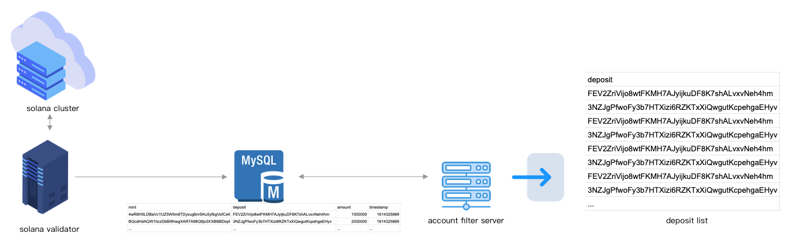
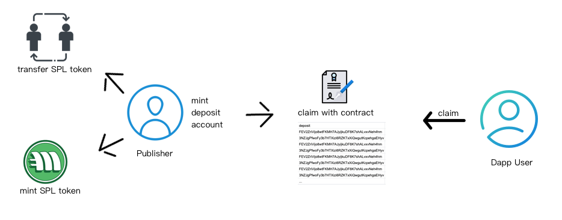
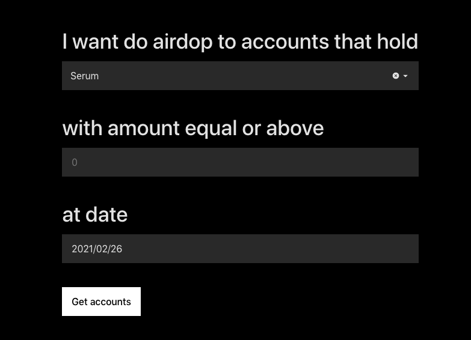
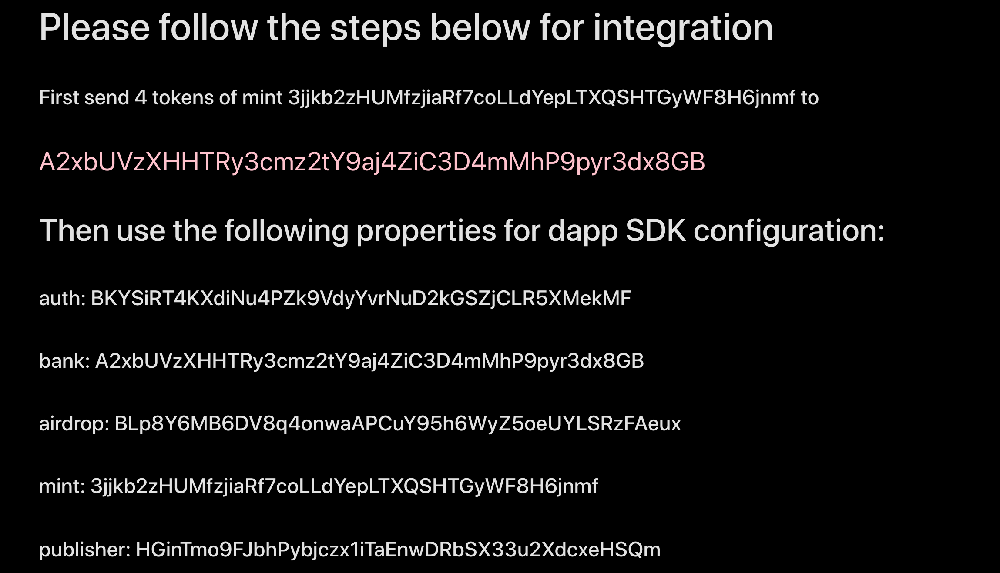

# SPLit

spl-it.app

Airdrop has become a very import part in crypro world which help projects 
to get seed users and reward loyal users.
SPLit is an tool which helps Solana Dapps to create and distribute airdrops.

## airdrop accounts query
SPLit now supports three filter parameters 

You can filter out accounts which hold more than a specific amount of tokens
at a specific snapshot

## airdrop

You can filter out specific accounts by set conditions on data snapshotted 
by us and airdrop them in three different ways:

* Direct transfer
* Direct mints
* Users need to claim themselves

### Transfer
If you wallet holds the toekn you want to airdop, you can diretcly send
to the accounts. SPLit will help you pack the transfers(instruction) into 
one transation and send directly to them. Since gas fee in Solana is very 
low, it won't cost too much even transfer to lots of accounts. Just make sure 
that you have enough tokens in your account.

### Mint
You can also directly mint tokens to them, also SPLit will pack all mint actions
to one package, please make sure than your account is the mint authority of the 
token you want to airdrop.

### Claim 
If you do not want to spend the gas fee our of your own pocket, or if you have other
reasons need users to claim by themselves, we also support that. This needs some 
interactions with our contracts and involve users to do some integration.

SPLit contranct will first create an *airdrop* account which saves the accounts 
you want to airdrop to and then generate a bank account which need users to transfer 
the tokens they use to airdrop，then when the account want to claim, they interact
with this bank contract which will send then tokens once they validate the account.

#### Integration

After you choose the Claim way to do the airdrop，you will get this info:

here is the corresponding use for each property:

|  prop   | function |
|  ----  | ----  |
| auth | ownder of bank|
| bank | store and send tokens |
| airdrop  | record of accounts |
| mint  | mint of token |
| publisher  | which initiates the airdrop |

You will need this info to config your SDK

#### SDK 
Airdrop provides a *splair.js* npm package, you can do

    npm install splair.js

or

    yarn add splair.js

to install SDK and import them like

    import { Airdrop,airdropHeadSpace } from "splair.js";

in your daoo，once the user connect wallets to sollet.io or SolongWallet
you can call this *Claim* function to initiate the claim which pops up 
the wallets to let the user sign

    async claim(account, mint, airdrop, auth, bank, publisher)

* account: user's account(who claims)
* mint: returns from SPLit contract
* airdrop: returns from SPLit contract
* auth: returns from SPLit contract
* bank: returns from SPLit contract
* publisher: returns from SPLit contract

After you call *Claim*，SDK will first create a deposit for the user
and then calls the bank contract api to claim the airdrops
    {
        "deposit":"",
        "mint":"",
    }

then you can show the balance of deposit by using:

    async querySPLBalance(deposite)

for query.