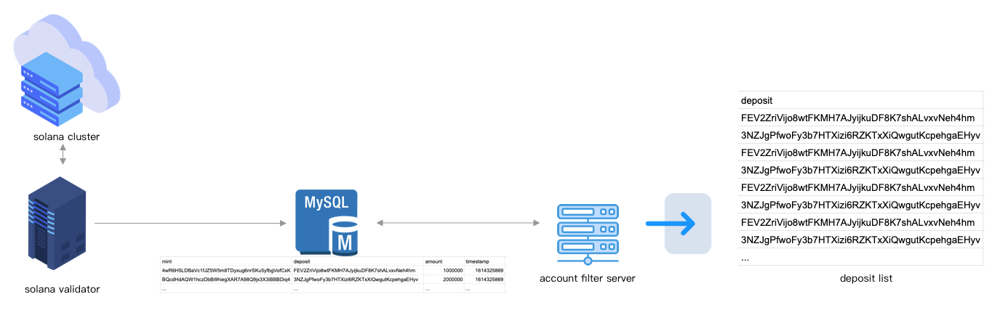
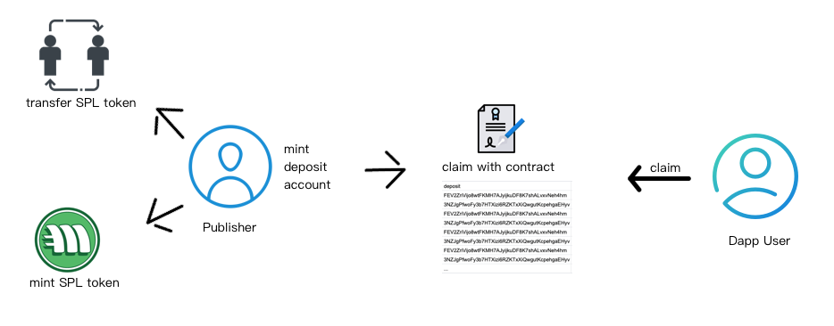
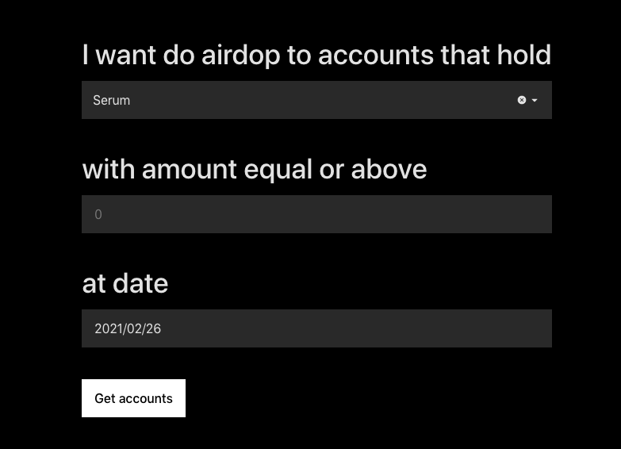
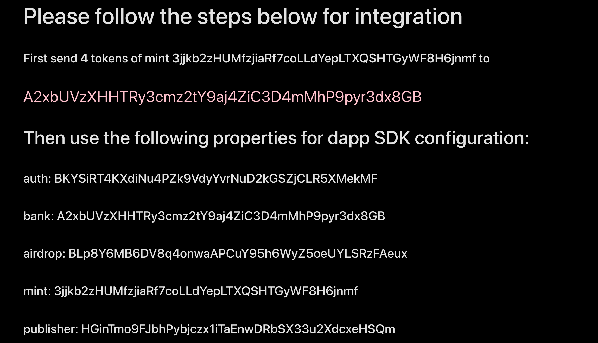

# SPLAir

SPLAir通过Solana的节点数据，对SPL代币账号进行了收归和整理,并通过合约控制，实现了
需要玩家主动Claim和合约进行交互来领取空投代币的空投模式。这种模式使得项目方可以
通过空投的方式，引导玩家来到项目页面，了解项目。

同时SPLAir也封装了直接转账和铸币的方式，方便没有项目主页的项目，空投自己的代币。

## airdrop用户查询
SPLAir提供了三个维度的
筛选条件，当选择：

可以筛选出在什么时间持有什么代币数量为多少的账号。

## airdrop

当前的SPLAir支持三种方式的空投，分别是：

* 转账
* 铸币
* 用户主动claim

### 转账
转账空投，就是有用户直接向前面按照条件过滤出来的账号进行转账，因为SOL账号和代币的
deposit的不同，这里需要用户选择自己持有的代币的账号，如果只有一个账号，系统会默认
选择好。选择好后，进行空投即可。需要注意的是，所有的转账会打包成一个Transaction，
所以需要用户保证这个deposit里面的余额充足，否则会全部失败。

### 铸币

铸币空投，是如果发布账号就是这个代币的Authority，那么可以直接通过minto的方式来给
过滤出来的账号进行空投，减少了代币账号转账的过程。一样的，选择好过滤条件后，
系统会对对过滤出来的账号用MintTo进行打包Transaction，经过钱包签名后进行完成空投。

### claim 
claim空投，需要玩家到业务方的网站上，点击一个Claim的按钮，来完成空投。这个方式主要
适用于项目方希望玩家来自己的网站上进行访问的场景，比如拉新。

claim空投会使用到SPLAir的合约，发布的时候会创建一个airdrop 的Account来存上面
过滤出来的用户信息，并生成一个bank账号，这个账号里面由项目方打入代币，之后等玩家
通过SPLAir 的SDK来Claim的时候，会通过合约从这个bank账号将代币转账给玩家对应的
deposit完成空投过程。因此需要项目方在空投后，自行打入足够对应的代币到这个bank账号。

另外发布空投信息的账号，即为这次空投的publisher发布账号，也是需要记录填入SDK的。

#### 前置信息

当通过claim的方式发布空投后，会得到类似

的界面，这里需要关注的信息有：

|  字段   | 意义  |
|  ----  | ----  |
| auth | bank的owner账号|
| bank | 发代币的账号，当玩家claim的时候，
会从这个账号给他转代币，因此需要提前给这个账号充值 |
| airdrop  | 空投信息账号 |
| mint  | 代币地址 |
| publisher  | 空投发布者的账号 |

这些信息需要在接入的SDK中填入。

#### SDK接入
Airdrop提供了npm的包，方便接入，在接入时，通过

    npm install splair.js

或者

    yarn add splair.js

来安装SDK。然后在代码中引入：

    import { Airdrop,airdropHeadSpace } from "splair.js";

在业务自己的网站上，首先通过钱包登录，可以是sollet.io或者SolongWallet或者其他
钱包，登录后，得到玩家的SOL账号。这里记作PlayerSOLAccount，

然后在玩家点击Claim的时候，调用：

    async claim(account, mint, airdrop, auth, bank, publisher)

方法，其中：

* account: 就是上面的PlayerSOLAccount，玩家账号
* mint: SPL代币地址，上面表格中发空投列出来的
* airdrop: 空投信息账号，上面表格中发空投列出来的
* auth: bank的owner账号，上面表格中发空投列出来的
* bank: 发代币的账号，上面表格中发空投列出来的
* publisher: 空投发布者的账号,上面表格中发空投列出来的

除了玩家账号，依次填入前面发空投的时候，返回的信息即可。

调用成功后，SDK会首先为PlayerSOLAccount创建一个新的代币地址deposit：

    {
        "deposit":"",
        "mint":"",
    }

然后项目这边展示deposit的余额就可以了。也可以通过SDK暴露的:

    async querySPLBalance(deposite)

来进行查询。